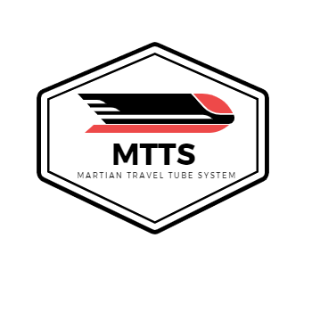

# Martian Travel Tube System

## What are we ?

### Project Concept:

We provide a fast, safe, reliable, fun and fully automatic travel system for dome inhabitants and companies. 
By offering the fastest way of transportation, it grants people less travel time, which translates to more sleep, freetime and worry free lives. 
For companies we offer a separate tubular network with larger pods to guarantee fast deliveries on large shipments. 

### Mission:
Our goal is to realise the fastest lead times possible:

By lead time we are referring to the speed at which goods can be delivered to their destination after placing an order. 
The speed at which a good is ordered and the delivery of it is, through our innovative system, unprecedented.

We are also referring to the efficiency of transporting humans to their desired / required location. 
Decreasing traveltime enriches human lives. Response time to emergency situations is drastically lowered. 
This allows our own emergency task force to respond quickly to infrastructural emergencies. 
All other emergency services also benefit from this, increasing safety by a large margin.

### Vision:
Through an easily accessible network of travel tubes we want to 
allow goods and people to travel more efficiently than ever.


## How do we do it ?

By creating a user-friendly mobile focused **client** application that communicates through a REST API and sockets with
our Java **server**. 


The client allows users to easily order pods for personal or package transportation. 

## Server

### Minimum requirements:

* Java version 11 or higher.
* Gradle

IntelliJ has gradle integration. 

 
### Quick setup:
* [Go to our server repository](https://git.ti.howest.be/TI/2020-2021/s3/project-ii/projects/groep-15/server)
* Clone the repository
* Run the server

Clone the repo through Gitlab: 


Or clone the repo using the commandline:
```shell
git clone https://git.ti.howest.be/TI/2020-2021/s3/project-ii/projects/groep-15/server.git
```
* Run the server through the GUI:


Or use the terminal:

navigate to the root of the project and execute

Windows: 
```shell
gradlew.bat run
```
Linux:
```shell
gradlew run
```

The server automatically creates the H2 Database, so no further configuration is needed.
The server should now be running and available for the client.

### Please refer to the server [readme](https://git.ti.howest.be/TI/2020-2021/s3/project-ii/projects/groep-15/server) file for more information. 

## Client

### [link to documentation](https://git.ti.howest.be/TI/2020-2021/s3/project-ii/projects/groep-15/client)

